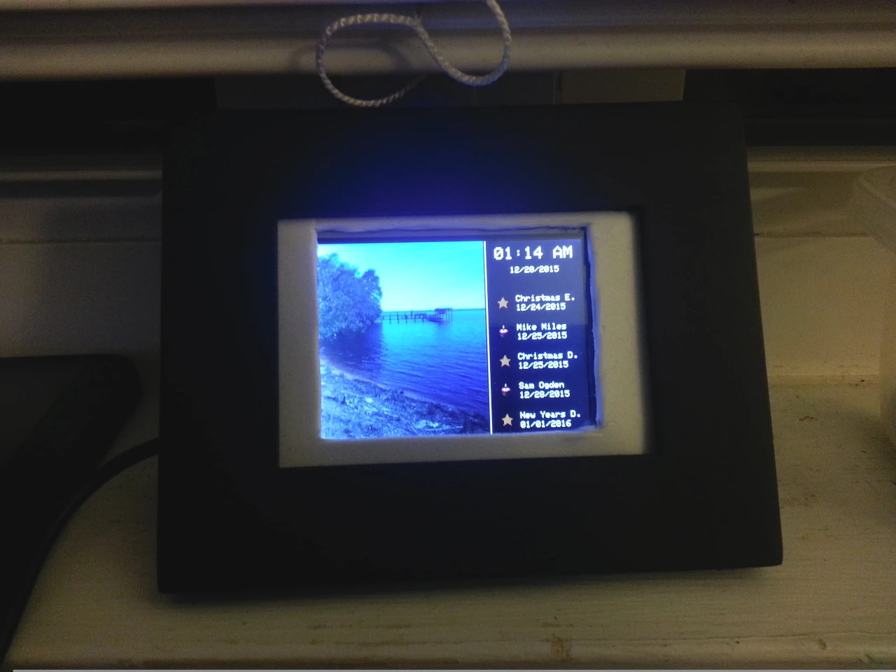

Arduino Family Calendar
-----------------------
**By Nathan Ogden**

A family calendar Arduino project. Displays upcoming events in the family and pictures from a micro SD card. Used Arduino + TTF shield + 3D printed case and gave to family as gifts.

## Usage

In the tools directory there are several 'compile' Python2 scripts that pack assets up in to binary files. Each of these binary files should be placed in the root directory on the micro SD card. Included with this project are samples of all asset types.
